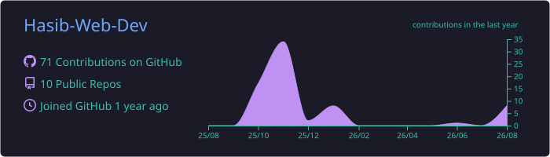
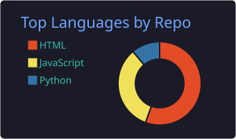
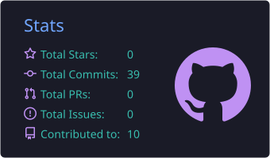
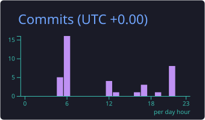

<!-- Header -->
<h1 align="center">Hi 👋, I'm Hasibul Alam</h1>

A motivated web developer focused on delivering efficient and visually appealing solutions

  

<!-- Quick Links -->

  🔗 <a href="https://hasib-web-dev.github.io/portfolio" target="_blank">My Portfolio</a> &nbsp; • &nbsp;
  📧 <a href="mailto:hasibulalam19775@gmail.com">hasibulalam19775@gmail.com</a>

<!-- Social -->
<!-- 🌐 Social -->

  <!-- GitHub (blue) -->
  

  <!-- Facebook -->
  

  <!-- LinkedIn -->
  

  <!-- Twitter (light blue visible) -->
  

---

### 🔭 Currently I am
- 🚀 Exploring **Next.js**
- 🛍️ Building an **Educational coaching center**

---

### 🧰 Languages & Tools

  
  
  
  
  
  
  
  
  
  
  
  
  
  

---

## 📊 GitHub Stats

  
  

  
  

  <!-- GitHub Streak (পাবলিক সার্ভিস ঠিক থাকলে লোড হবে) -->
  

---

### 🗂️ Featured Projects

- 🏷️ **Faith Coaching Home**  
  A responsive website for an educational coaching center  
  🔗 [Live](https://hasib-web-dev.github.io/Faith-Coaching-Home/) • [Code](https://github.com/Hasib-Web-Dev/Faith-Coaching-Home)

- 🏷️ **Portfolio Website**  
  Personal showcase built with HTML, CSS, JS  
  🔗 [Live](https://hasib-web-dev.github.io/portfolio) • [Code](https://github.com/Hasib-Web-Dev/portfolio)

---

### ✍️ About Me
- 💻 Passionate about front-end and back-end web technologies  
- 🧩 Always learning and improving my skills  
- 🌍 Open to remote work and collaboration  

  
  

